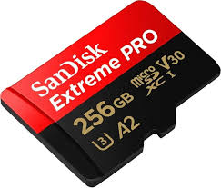

# gopro-format

Prepare an SD card for GoPro Hero action cameras on Ubuntu Linux. Uses `badblocks` for destructive bad-block testing, `f3probe` for fake/counterfeit flash detection, and stamps each card with a unique date-sequenced label (e.g. `GP26012701`) so you can track which card was formatted when.

## Why this exists

Since the fall of 2019, starting with the Hero8, I have dealt with persistent SD card errors across multiple GoPro cameras. The cards have always been top-of-the-line SanDisk Extreme Pro — and I have always formatted exclusively through the GoPro's built-in UI. After extensive research and trial and error, I believe the root cause is GoPro's in-camera "quick format," which does not write a fresh partition table or perform a full format. This script replaces that process entirely by writing a clean msdos partition table and performing a proper exFAT format from a Linux workstation.

## Overview

Automates the full wipe-and-format workflow: device detection, bad-block testing, fake flash detection, partition table creation, and exFAT formatting with a unique volume label. Every format is logged with timestamp, label, device, size, and model so you can trace any card's history.

<p>
  
  
</p>

**Update:** A certain AI assistant (who shall remain nameless) has suggested that Samsung Pro Plus cards might be worth trying as an alternative to the SanDisk Extreme Pro. Take that recommendation for what it's worth — but hey, even artificial intelligence gets tired of hearing about SD card errors.

## Usage

```bash
sudo ./gopro-format              # auto-detect SD card
sudo ./gopro-format /dev/sdb     # specify device
sudo ./gopro-format -b           # check for bad blocks first
sudo ./gopro-format -f           # check for fake/counterfeit flash
sudo ./gopro-format -b -f        # both checks before formatting
./gopro-format -l                # list full format history
./gopro-format -c GP26012701     # look up a specific label
sudo ./gopro-format -c           # read inserted card's label and look it up
```

## What it does

1. **Detects** removable block devices (`/sys/block/*/removable`) or accepts a device argument
2. **Displays** device info (`lsblk`) and current partition table (`parted print free`) for confirmation
3. **Unmounts** any mounted partitions on the device
4. **Bad block check** (optional `-b` flag) — runs a destructive write test (`badblocks -wsv`) that writes and verifies test patterns on every sector. Warns if the card should be replaced.
5. **Fake flash check** (optional `-f` flag) — runs `f3probe --destructive` to detect counterfeit cards that misreport their capacity. Warns if the card is fraudulent.
6. **Creates** an msdos partition table with a single primary partition spanning the whole card
7. **Formats** the partition as exFAT with a unique label (`GP` + `YYMMDD` + 2-digit sequence, e.g. `GP26012701`)
8. **Logs** the format to `gopro-format.log` (timestamp, label, device, size, model)

## Requirements

- `parted`
- `exfatprogs` (or `exfat-utils`)
- `e2fsprogs` (provides `badblocks`, only needed with `-b`)
- `f3` (provides `f3probe`, only needed with `-f`)

All are available via `apt`:

```bash
sudo apt install parted exfatprogs e2fsprogs f3
```

## Notes

- Requires root (`sudo`)
- Supports both `/dev/sdX` (USB readers) and `/dev/mmcblkX` (built-in readers)
- The `-b` bad block test is destructive (writes test patterns) but this is fine since the card is about to be formatted anyway
- The `-f` fake flash check is also destructive but runs before partitioning, so no data loss beyond what the format already does
- If bad blocks are found, the card's internal wear-leveling has exhausted its spare sectors and the card should be replaced
- If `f3probe` detects a counterfeit card, the reported capacity is fake and the card should not be trusted
